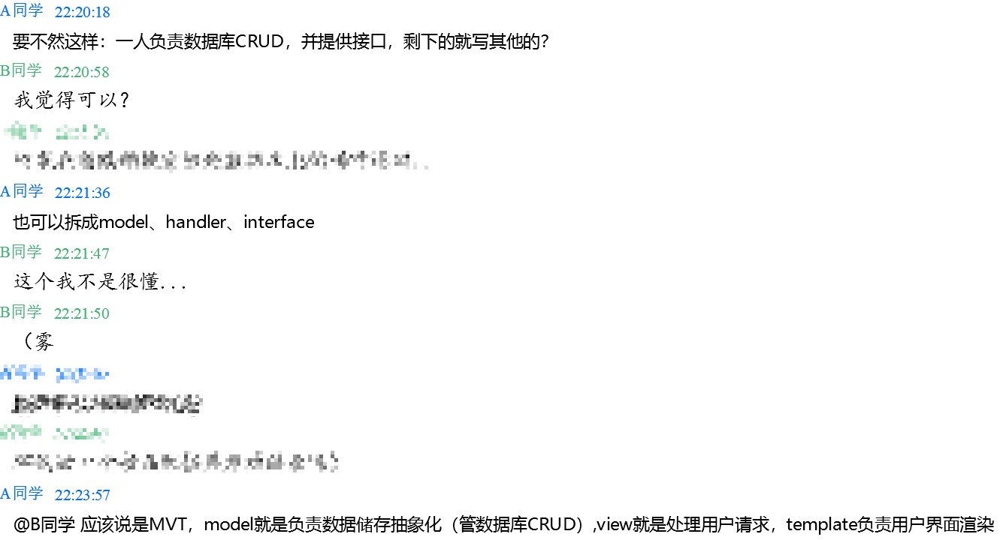
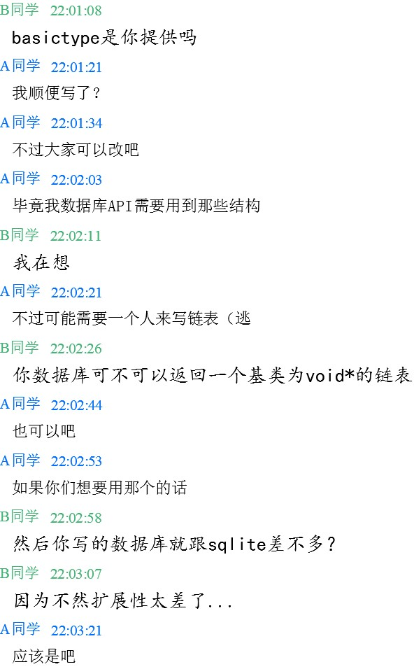
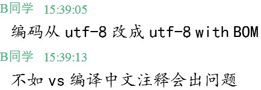

# 1 大程序简介

## 1.1 选题背景及意义

## 1.2 目标要求

## 1.3 术语说明

# 2 功能需求分析

# 3 程序开发设计

## 3.1 总体架构设计

## 3.2 功能模块设计

## 3.3 数据结构设计

## 3.4 源代码文件组织设计

## 3.5 函数设计描述

### libgraphics

#### graphics.c

##### loadImage

* 函数原型

  ```c
  void loadImage(const char *image, LibImage *mapbuf);
  ```

* 功能描述

  加载 jpg 图片到一个 LibImage 中

* 参数描述

  * `image`: 图片的存储位置
  * `mapbuf`: 存储 LibImage 的地方

* 返回值描述

  无

* 重要局部变量定义

  ```c
  IPicture *ipicture;
  ```

* 重要局部变量用途描述

  * `ipicture`: 存储指向图片的接口指针

* 函数算法描述

  先读入图片，再通过 Win32API 把图片绘制到 LibImage 中

##### copyImage

* 函数原型

  ```c
  void copyImage(LibImage *dst, LibImage *src);
  ```

* 功能描述

  深拷贝图片

* 参数描述

  * `src`: 指向原图片
  * `dst`: 指向新图片要存储的位置

* 返回值描述

  无

* 重要局部变量定义

  无

* 重要局部变量用途描述

  无

* 函数算法描述

  通过 Win32API 将原 LibImage 中 hbitmap 句柄指向的 bmp 图片深拷贝到新 LibImage 中

##### DrawImage

* 函数原型

  ```c
  void DrawImage(LibImage* pImage, int px_x, int px_y, int px_width,
                 int px_height);
  ```

* 功能描述

  在指定位置绘制图片

* 参数描述

  * `pImage`: 指向要绘制的图片
  * `px_x`: 图片左上角的横轴坐标（像素为单位）
  * `px_y`: 图片左上角的纵轴坐标（像素为单位）
  * `px_width`: 图片要绘制的宽度（像素为单位）
  * `px_height`: 图片要绘制的高度（像素为单位）

* 返回值描述

  无

* 重要局部变量定义

  无

* 重要局部变量用途描述

  无

* 函数算法描述

  创建一个当前窗口的设备上下文环境，使用 Win32API 将图片刷进去，然后刷新这篇区域并释放创建的设备上下文环境

##### SelectFile

* 函数原型

  ```c
  void SelectFile(const char filter[], const char extension[],
                  const bool new_file, char path[], const int max_length);
  ```

* 功能描述

  创建一个 Open dialog box（中文可能叫打开文件对话框），并返回用户选择的文件地址

* 参数描述

  * `filter`: 限制可选择的文件的后缀，如 "JPG image\0\*.jpg;\*.jpeg;*.jpe\0"
  * `extension`: 默认后缀（不含英文句点且3个字符及以内）
  * `new_file`: 是否允许用户新建文件
  * `path[]`: 储存用户选择的文件地址
  * `max_length`: `path[]` 的最大可存储字符数

* 返回值描述

  无

* 重要局部变量定义

  ```c
  OPENFILENAME ofn;
  ```

* 重要局部变量用途描述

  `ofn`: 储存传入参数对于对话框的设置，用于调用 Win32API

* 函数算法描述

  在 `ofn` 中设置好调用者提供的对话框参数之后调用 Win32API

##### SelectFolder

* 函数原型

  ```c
  void SelectFolder(const char hint_text[], char path[]);
  ```

* 功能描述

  创建一个对话框，并返回用户选择的文件夹地址

* 参数描述

  `hint_text`: 在对话框中显示的提示性信息
  `path`: 储存用户选择的文件夹地址（要求至少能存储 `MAX_PATH` 个字符，`MAX_PATH` 在头文件 minwindef.h 中有定义）

* 返回值描述

  无

* 重要局部变量定义

  ```c
  BROWSEINFO bInfo;
  ```

* 重要局部变量用途描述

  * `bInfo`: 储存传入参数对于对话框的设置，用于调用 Win32API

* 函数算法描述

  在 `bInfo` 中设置好调用者提供的对话框参数之后调用 Win32API

### model

#### list.c

##### NewList

* 函数原型

  ```c
  List *NewList();
  ```

* 功能描述

  初始化一个链表

* 参数描述

  无

* 返回值描述

  返回已初始化的链表

* 重要局部变量定义

  无

* 重要局部变量用途描述

  无

* 函数算法描述

  先动态申请空间，然后将 `dummy_head` 和 `dummy_tail` 连起来。返回链表指针

##### DeleteList

* 函数原型

  ```c
  void DeleteList(const List *const list, void (*Free)(void *const value));
  ```

* 功能描述

  删除链表

* 参数描述

  * `list`: 待删除的链表
  * `Free`: 释放链表储存内容的函数

* 返回值描述

* 重要局部变量定义

  无

* 重要局部变量用途描述

  无

* 函数算法描述

  先调用 `ClearList` 再释放 `list` 的空间

##### ClearList

* 函数原型

  ```c
  void ClearList(List *const list, void (*Free)(void *const value));
  ```

* 功能描述

  清空列表

* 参数描述

  * `list`: 待清空的链表
  * `Free`: 释放链表储存内容的函数

* 返回值描述

* 重要局部变量定义

  ```c
  const ListNode *now = list->dummy_head->nxt;
  ```

* 重要局部变量用途描述

  * `now`: 当前待删除的节点

* 函数算法描述

  逐个调用 `EraseList` 删除节点

##### InsertList

* 函数原型

  ```c
  const ListNode *InsertList(List *const list, ListNode *const pos,
                             void *const value);
  ```

* 功能描述

  在指定节点之前插入节点

* 参数描述

  * `list`: 待修改的链表
  * `pos`: 插入节点的位置
  * `value`: 待插入的节点的值

* 返回值描述

  指向插入的节点的指针

* 重要局部变量定义

  ```c
  ListNode *new_node = (ListNode *)malloc(sizeof(ListNode));
  ```

* 重要局部变量用途描述

  * `new_node`: 待插入的节点

* 函数算法描述

  为待插入的节点申请空间，与待插入位置的前后节点相连，更新链表的节点个数。返回插入后的节点

##### EraseList

* 函数原型

  ```c
  const ListNode *EraseList(List *const list, const ListNode *const node,
                            void (*Free)(void *const value));
  ```

* 功能描述

  删除链表中的指定节点

* 参数描述

  * `list`: 待修改的链表
  * `node`: 待删除的节点
  * `Free`: 释放链表储存内容的函数

* 返回值描述

  返回指向删除的节点后面的节点的指针

* 重要局部变量定义

  ```c
  const ListNode *ret = node->nxt;
  ```

* 重要局部变量用途描述

  * `ret`: 存储返回值

* 函数算法描述

  将待删除节点的前后节点相连，释放待删除节点的空间

##### SortList

* 函数原型

  ```c
  void SortList(const List *const list,
                bool (*cmp)(const void *const lhs, const void *const rhs));
  ```

* 功能描述

  对链表进行排序

* 参数描述

  * `list`: 待排序的链表
  * `cmp`: 比较函数，传入两个链表节点的值，返回左边是否小于等于右边

* 返回值描述

  无

* 重要局部变量定义

  ```c
  int l;
  ListNode *now, *left_now, *left_end, *right_now, *right_end;
  ```

* 重要局部变量用途描述

  * `l`: 当前归并的区间长度的一半
  * `now`: 最后一个已排好的节点
  * `left_now` / `left_end`: 第一个待排序的半区间为 [`left_now`, `left_end`)
  * `right_now` / `right_end`: 第二个待排序的半区间为 [`right_now`, `right_end`)

* 函数算法描述

  为了保证排序稳定且排序前后指向链表节点的指针依旧有效，采用归并排序。由于递归太耗时，使用非递归方式归并排序。每次排序倍增待排序的区间长度，然后遍历链表内的所有区间并每次合并两个已排好序的半区间。

##### UniqueList

* 函数原型

  ```c
  void UniqueList(List *const list,
                  bool (*cmp)(const void *const lhs, const void *const rhs),
                  void (*Free)(void *const value));
  ```

* 功能描述

  对已排好序的链表进行去重

* 参数描述

  * `list`: 待排序的链表
  * `cmp`: 比较函数，传入两个链表节点的值，返回左边是否等于右边
  * `Free`: 释放链表储存内容的函数

* 返回值描述

  无

* 重要局部变量定义

  无

* 重要局部变量用途描述

  无

* 函数算法描述

  遍历链表，如果链表中的某个节点与它之前的节点相同，则删除这个节点

##### DuplicateList

* 函数原型

  ```c
  List *DuplicateList(const List *const list,
                      void *const (*Duplicate)(void *const value));
  ```

* 功能描述

  深拷贝指定链表

* 参数描述

  * `list`: 待拷贝的链表
  * `Duplicate`: 深拷贝链表节点的值的函数

* 返回值描述

  指向深拷贝出的链表的指针

* 重要局部变量定义

  无

* 重要局部变量用途描述

  无

* 函数算法描述

  先调用 `NewList` 创建新链表，对老链表的每个节点逐个调用 `Duplicate` 函数深拷贝节点的值，返回新的链表

##### CombineListNode

* 函数原型

  ```c
  static inline void CombineListNode(ListNode *const left, ListNode *const right);
  ```

* 功能描述

  使得传入的两个节点相连

* 参数描述

  * `left`: 待连接的前面的节点
  * `right`: 待链接的后面的节点

* 返回值描述

  无

* 重要局部变量定义

  无

* 重要局部变量用途描述

  无

* 函数算法描述

  使 `left` 的后继为 `right`，使 `right` 的前驱为 `left`

##### MoveListNode

* 函数原型

  ```c
  static inline ListNode *MoveListNode(const List *const list,
                                       const ListNode *const node, int step);
  ```

* 功能描述

  返回指向某节点后面指定个节点的指针

* 参数描述

  * `list`: 节点所在链表
  * `node`: 初始节点
  * `step`: 两节点距离

* 返回值描述

  见功能描述

* 重要局部变量定义

  无

* 重要局部变量用途描述

  无

* 函数算法描述

  从 `node` 节点向后移 `step` 步，除非到达链表末尾

### template

### view

#### main.c

##### Main

* 函数原型

  ```c
  void Main();
  ```

* 功能描述

  调用 template 和 view 的初始化函数，启动程序

* 参数描述

  无

* 返回值描述

  无

* 重要局部变量定义

  无

* 重要局部变量用途描述

  无

* 函数算法描述

  无

#### hash.c

##### Sha256Sum

* 函数原型

  ```c
  void Sha256Sum(uint32_t *const dst, const uint8_t *const src,
                 const uint32_t len);
  ```

* 功能描述

  计算 `src` 中存储的长度为 `len` 的数据的 SHA-256 值并存放在 `dst` 中。将原数据摘要成一个256位的数据。

* 参数描述

  * `dst`: 用以储存哈希值的数组，要求至少 32 字节（也就是 8 个 uint32_t)
  * `src`: 存储原数据的数组
  * `len`: 原数据的长度

* 返回值描述

  无

* 重要局部变量定义

  ```c
  uint32_t n = len / SHA256_BLOCK_SIZE;
  uint32_t m = len % SHA256_BLOCK_SIZE;
  uint8_t cover_data[SHA256_BLOCK_SIZE * 2];
  uint32_t h[8] = { /* details omitted */ };
  ```

* 重要局部变量用途描述

  * `n`: 原数据切分成512位一组后的完整的组数
  * `m`: 原数据切分之后剩余的部分的长度
  * `cover_data`: 原数据切分的多余部分进行补齐之后的数据
  * `h[]`: 哈希值

* 函数算法描述

  先对原数据进行512一组的切分，剩余部分进行补齐并使得新数据的结尾为原数据的比特数（表示形式为64位大端无符号整形）。然后对每一组数据重复 `ChunkProcess` 进行哈希处理，更新 `h[]`。全部处理结束之后 `h[]` 中的数据即为结果。将 `h[]` 中的数据拷贝到 `dst[]` 中

##### ChunkProcess

* 函数原型

  ```c
  static void ChunkProcess(const uint8_t *msg, uint32_t *h);
  ```

* 功能描述

  对 `msg` 中存储的512位数据进行哈希处理并将结果存在 `h[]` 中

* 参数描述

  * `msg`: 512位待进行哈希处理的数据
  * `h[]`: 存储原来的哈希值，新的哈希值也将保存在这里

* 返回值描述

  无

* 重要局部变量定义

  ```c
  static uint32_t k[64] = { /* details omitted */ }
  uint32_t w[64], new_h[8];
  ```

* 重要局部变量用途描述

  * `k[]`: SHA-256 算法中的固定常量
  * `w[]`: 32位的单词。其中前16个单词为传入的512位数据。后48个单词通过固定算法由前面的单词生成
  * `new_h`: 由整个消息（前面生成的单词组 `w[]`）和传入的原哈希值 `h[]` 通过固定算法生成的新的哈希值

* 函数算法描述

  通过各种位运算生成消息并计算其哈希值，详见参考资料

##### RandStr

* 函数原型

  ```c
  void RandStr(char *const dst, const unsigned len);
  ```

* 功能描述

  在 `dst[]` 中生成长度为 `len` 的随机字符串（字典为 ASCII 表（不含扩展表）中的所有可见打印字符）

* 参数描述

  * `dst[]`: 存储随机字符串的数组
  * `len`: 随机字符串的长度

* 返回值描述

  无

* 重要局部变量定义

  无

* 重要局部变量用途描述

  无

* 函数算法描述

  以调用函数时的时间戳为随机种子，逐个生成字符串中的每个字符

#### utility.c

##### InitUtility

* 函数原型

  ```c
  void InitUtility();
  ```

* 功能描述

  初始化日志文件

* 参数描述

  无

* 返回值描述

  无

* 重要局部变量定义

  无

* 重要局部变量用途描述

  无

* 函数算法描述

  无

##### UninitUtility

* 函数原型

  ```c
  void UninitUtility();
  ```

* 功能描述

  关闭日志文件

* 参数描述

  无

* 返回值描述

  无

* 重要局部变量定义

  无

* 重要局部变量用途描述

  无

* 函数算法描述

  无

##### Log

* 函数原型

  ```c
  void Log(char *const msg);
  ```

* 功能描述

  将 `msg[]` 前加上当地时间并写入日志文件

* 参数描述

  `msg[]`: 要写入日志文件的消息

* 返回值描述

  无

* 重要局部变量定义

  ```c
  const time_t cur_time = time(0);
  ```

* 重要局部变量用途描述

  * `cur_time`: 当前时间

* 函数算法描述

  获取当前时间之后先后使用 `loacltime` 函数和 `asctime` 函数将其转换为当地时间的字符串表示，并将字符串结尾的换行符去除。将时间字符串及 `msg[]` 输出到日志文件之中

##### MoveInList

* 函数原型

  ```c
  char *MoveInList(ListNode **const node, List *list, int max_size,
                   bool direction, const char *const list_name,
                   const char *const page_name);
  ```

* 功能描述

  将 `node` 在链表 `list` 中的指向向 `direction`（0为向前，1为向后）方向移动 `max_size` 个节点，并返回相应的日志消息（当前链表名为 `list_name`，当前界面名为 `page_name`）

* 参数描述

  见功能描述

* 返回值描述

  见功能描述

* 重要局部变量定义

  无

* 重要局部变量用途描述

  无

* 函数算法描述

  见功能描述。注意如果移动失败（超过链表结尾或开头）则 `node` 的指向不变并返回报告出错的日志消息

##### ErrorHandle

* 函数原型

  ```c
  bool ErrorHandle(int errno_, int num, ...)
  ```

* 功能描述

  处理数据库操作的返回值，如果数据库操作失败，则绘制历史记录中的上一个页面并显示错误信息

* 参数描述

  * `errno_`: 数据库操作返回的错误码
  * `num`: 可变参数的个数
  * 可变参数: 可以视作成功的错误码

* 返回值描述

  如果为 FALSE 则表示数据库操作成功，如果为 TRUE 则表示数据库操作失败

* 重要局部变量定义

  无

* 重要局部变量用途描述

  无

* 函数算法描述

  见功能描述

##### InitCheck

* 函数原型

  ```c
  bool InitCheck(bool no_user);
  ```

* 功能描述

  验证数据库是否打开以及当前是否有用户登录，检查如果失败则绘制历史记录中的上一个页面并显示错误信息

* 参数描述

  `no_user`: TRUE 表示可以接受没有用户登录

* 返回值描述

  TRUE 表示检查失败（如数据库未打开或用户未登录），FALSE 表示检查没有问题

* 重要局部变量定义

  无

* 重要局部变量用途描述

  无

* 函数算法描述

  见功能描述

##### CmpGreaterBorrowRecordByReturnTime

* 函数原型

  ```c
  bool CmpGreaterBorrowRecordByReturnTime(const void *const lhs,
                                          const void *const rhs)
  ```

* 功能描述

  以归还时间为关键字比较两个指向 BorrowRecord 的指针

* 参数描述

  *  `lhs`: 指向不等号左边的值的指针
  *  `rhs`: 指向不等号右边的值的指针

* 返回值描述

  返回 `lhs` 的归还时间是否大于等于 `rhs`

* 重要局部变量定义

  无

* 重要局部变量用途描述

  无

* 函数算法描述

  无

##### CmpLessBorrowRecordByReturnTime

* 函数原型

  ```c
  bool CmpLessBorrowRecordByReturnTime(const void *const lhs,
                                       const void *const rhs)
  ```

* 功能描述

  以归还时间为关键字比较两个指向 BorrowRecord 的指针

* 参数描述

  *  `lhs`: 指向不等号左边的值的指针
  *  `rhs`: 指向不等号右边的值的指针

* 返回值描述

  返回 `lhs` 的归还时间是否小于等于 `rhs`

* 重要局部变量定义

  无

* 重要局部变量用途描述

  无

* 函数算法描述

  无

##### CmpLessBookById

* 函数原型

  ```c
  bool CmpLessBookById(const void *const lhs, const void *const rhs);
  ```

* 功能描述

  以书号为关键字比较两个指向 Book 的指针

* 参数描述

  *  `lhs`: 指向不等号左边的值的指针
  *  `rhs`: 指向不等号右边的值的指针

* 返回值描述

  返回 `lhs` 的书号是否小于等于 `rhs`

* 重要局部变量定义

  无

* 重要局部变量用途描述

  无

* 函数算法描述

  无

##### CmpLessBookByTitle

* 函数原型

  ```c
  bool CmpLessBookByTitle(const void *const lhs, const void *const rhs);
  ```

* 功能描述

  以书名为关键字比较两个指向 Book 的指针

* 参数描述

  *  `lhs`: 指向不等号左边的值的指针
  *  `rhs`: 指向不等号右边的值的指针

* 返回值描述

  返回 `lhs` 的书名是否小于等于 `rhs`

* 重要局部变量定义

  无

* 重要局部变量用途描述

  无

* 函数算法描述

  无

##### CmpLessBookByAuthor

* 函数原型

  ```c
  bool CmpLessBookByAuthor(const void *const lhs, const void *const rhs);
  ```

* 功能描述

  以第一作者为关键字比较两个指向 Book 的指针

* 参数描述

  *  `lhs`: 指向不等号左边的值的指针
  *  `rhs`: 指向不等号右边的值的指针

* 返回值描述

  返回 `lhs` 的第一作者是否小于等于 `rhs`

* 重要局部变量定义

  无

* 重要局部变量用途描述

  无

* 函数算法描述

  无

##### CmpLessUserById

* 函数原型

  ```c
  bool CmpLessUserById(const void *const lhs, const void *const rhs);
  ```

* 功能描述

  以第一作者为关键字比较两个指向 User 的指针

* 参数描述

  *  `lhs`: 指向不等号左边的值的指针
  *  `rhs`: 指向不等号右边的值的指针

* 返回值描述

  返回 `lhs` 的用户号是否小于等于 `rhs`

* 重要局部变量定义

  无

* 重要局部变量用途描述

  无

* 函数算法描述

  无

##### CmpLessUserByName

* 函数原型

  ```c
  bool CmpLessUserByName(const void *const lhs, const void *const rhs);
  ```

* 功能描述

  以第一作者为关键字比较两个指向 User 的指针

* 参数描述

  *  `lhs`: 指向不等号左边的值的指针
  *  `rhs`: 指向不等号右边的值的指针

* 返回值描述

  返回 `lhs` 的姓名是否小于等于 `rhs`

* 重要局部变量定义

  无

* 重要局部变量用途描述

  无

* 函数算法描述

  无

##### CmpLessUserByDepartment

* 函数原型

  ```c
  bool CmpLessUserByDepartment(const void *const lhs, const void *const rhs);
  ```

* 功能描述

  以第一作者为关键字比较两个指向 User 的指针

* 参数描述

  *  `lhs`: 指向不等号左边的值的指针
  *  `rhs`: 指向不等号右边的值的指针

* 返回值描述

  返回 `lhs` 的部门是否小于等于 `rhs`

* 重要局部变量定义

  无

* 重要局部变量用途描述

  无

* 函数算法描述

  无

##### StrCpy

* 函数原型

  ```c
  void *const StrCpy(void *const str);
  ```

* 功能描述

  深拷贝 `str` 中储存的字符串

* 参数描述

  * `str`: 待拷贝的字符串

* 返回值描述

  * 返回复制出的字符串

* 重要局部变量定义

  * 无

* 重要局部变量用途描述

  * 无

* 函数算法描述

  使用 `malloc` 为返回的字符串分配空间然后 `strcpy` 过去

##### StrLess

* 函数原型

  ```c
  bool StrLess(const void *const lhs, const void *rhs);
  ```

* 功能描述

  比较两个字符串

* 参数描述

  *  `lhs`: 指向不等号左边的值的指针
  *  `rhs`: 指向不等号右边的值的指针

* 返回值描述

  返回 `lhs` 是否小于等于 `rhs`

* 重要局部变量定义

* 重要局部变量用途描述

* 函数算法描述

##### StrSame

* 函数原型

  ```c
  bool StrSame(const void *const lhs, const void *rhs);
  ```

* 功能描述

  比较两个字符串

* 参数描述

  *  `lhs`: 指向不等号左边的值的指针
  *  `rhs`: 指向不等号右边的值的指针

* 返回值描述

  返回 `lhs` 是否等于 `rhs`

* 重要局部变量定义

* 重要局部变量用途描述

* 函数算法描述

##### GetTime

* 函数原型

  ```c
  char *GetTime(time_t dst_tm);
  ```

* 功能描述

  将 time_t 转换成格式为 YYYYMMDD 的字符串。

* 参数描述

  * `dst_tm`: 需要转换的时间戳

* 返回值描述

  返回对应字符串。注意：指针指向静态储存区，请不要 `free`

* 重要局部变量定义

  无

* 重要局部变量用途描述

  无

* 函数算法描述

  无

##### GetBorrowRecordNumberAfter

* 函数原型

  ```c
  int GetBorrowRecordNumberAfter(List *borrow_record, time_t dst_tm);
  ```

* 功能描述

  统计链表 `borrow_record` 中借阅时间在 `dst_tm` 之后的借阅记录的个数

* 参数描述

  * `borrow_record`: 待统计的借阅记录。注意：在传入之前应先按归还时间的降序排序
  * `det_tm`: 要求的时间

* 返回值描述

  满足要求的借阅记录的个数

* 重要局部变量定义

  无

* 重要局部变量用途描述

  无

* 函数算法描述

  遍历整个链表直至归还时间早于要求的时间。（由于调用此函数时链表均已按照归还时间排序过，所以可以这样剪枝）

#### history.c

##### InitHistory

* 函数原型

  ```c
  void InitHistory();
  ```

* 功能描述

  初始化历史记录

* 参数描述

  无

* 返回值描述

  无

* 重要局部变量定义

  无

* 重要局部变量用途描述

  无

* 函数算法描述

  初始化历史记录链表

##### UninitHistory

* 函数原型

  ```c
  void UninitHistory();
  ```

* 功能描述

  关闭历史记录模块

* 参数描述

  无

* 返回值描述

  无

* 重要局部变量定义

  无

* 重要局部变量用途描述

  无

* 函数算法描述

  清空并释放历史记录列表

##### TopHistory

* 函数原型

  ```c
  History *const TopHistory();
  ```

* 功能描述

  返回历史记录模块中栈顶的历史记录（函数只是为了提高代码简洁性，只要编译器优化级别不过于保守，应该会自动内联）

* 参数描述

  无

* 返回值描述

  指向栈顶历史记录的指针

* 重要局部变量定义

  无

* 重要局部变量用途描述

  无

* 函数算法描述

  无

##### PushHistory

* 函数原型

  ```c
  void PushBackHistory(History *const new_history);
  ```

* 功能描述

  向栈中压入新的历史记录

* 参数描述

  `new_history`: 指向新历史记录的指针

* 返回值描述

  无

* 重要局部变量定义

  无

* 重要局部变量用途描述

  无

* 函数算法描述

  直接加入链表末尾，如果链表大小超过设置的历史记录上限，则弹出链表开头的历史记录

##### PopHistory

* 函数原型

  ```c
  void PopBackHistory();
  ```

* 功能描述

  弹出栈顶历史记录

* 参数描述

  无

* 返回值描述

  无

* 重要局部变量定义

  无

* 重要局部变量用途描述

  无

* 函数算法描述

  无

##### ClearHistory

* 函数原型

  ```c
  void ClearHistory();
  ```

* 功能描述

  清空历史记录

* 参数描述

  无

* 返回值描述

  无

* 重要局部变量定义

  无

* 重要局部变量用途描述

  无

* 函数算法描述

  不断调用 `PopBackHistory` 直至栈为空

##### FreeHistory

* 函数原型

  ```c
  void FreeHistory(void *const history_);
  ```

* 功能描述

  释放历史记录的栈中的元素的内存

* 参数描述

  * `history_`: 指向要释放的历史记录的指针

* 返回值描述

  无

* 重要局部变量定义

  无

* 重要局部变量用途描述

  无

* 函数算法描述

  释放历史记录中动态申请出来的内存（如链表、字符串等）

##### ReturnHistory

* 函数原型

  ```c
  void ReturnHistory(ListNode *go_back_to, char *msg);
  ```

* 功能描述

  回滚到指定的历史记录，并输出相应的日志信息

* 参数描述

  * `go_back_to`: 指向要回滚到的历史记录
  * `msg`: 要输出的日志信息

* 返回值描述

  无

* 重要局部变量定义

  无

* 重要局部变量用途描述

  无

* 函数算法描述

  根据要回滚到的历史记录的页面不同绘制对应的页面，如果栈被清空了，则绘制欢迎界面

#### view.c

##### InitView

* 函数原型

  ```c
  void InitView();
  ```

* 功能描述

  初始化 view 模块

* 参数描述

  无

* 返回值描述

  无

* 重要局部变量定义

  无

* 重要局部变量用途描述

  无

* 函数算法描述

  调用 `InitHistory` 与 `InitUtility`，加载资源并绘制欢迎界面

##### NavigationCallback

* 函数原型

  ```c
  void NavigationCallback(Page nav_page);
  ```

* 功能描述

  响应用户导航栏的操作

* 参数描述

  * `nav_page`: 用户选择的界面

* 返回值描述

  无

* 重要局部变量定义

  无

* 重要局部变量用途描述

  无

* 函数算法描述

  调用对应的处理函数

##### Navigation_LendAndBorrow

* 函数原型

  ```c
  void Navigation_LendAndBorrow(char *msg);
  ```

* 功能描述

  处理 LendAndBorrow 界面需要显示的东西并调用绘制函数

* 参数描述

  * `msg`: 日志消息，如果为空则函数自行生成

* 返回值描述

  无

* 重要局部变量定义

  ```c
  List *borrow_records_list = NewList();
  List *books = NewList();
  History *const new_history = malloc(sizeof(History));
  ```

* 重要局部变量用途描述

  * `borrow_records_list`: 当前用户还没有归还的图书借阅记录
  * `books`: 对应的借阅记录的图书
  * `new_history`: 这一次的历史记录

* 函数算法描述

  从借阅记录数据库中筛选出所有满足要求的借阅记录，再遍历一遍，从图书数据库中提取出对应的图书，初始化这一次历史记录的各个参数，调用 `DrawUI`

##### Navigation_BookSearch

* 函数原型

  ```c
  void Navigation_BookSearch(char *msg);
  ```

* 功能描述

  处理 BookSearch 界面需要显示的东西并调用绘制函数

* 参数描述

  * `msg`: 日志消息，如果为空则函数自行生成

* 返回值描述

  无

* 重要局部变量定义

  无

* 重要局部变量用途描述

  无

* 函数算法描述

  导航栏单击图书搜索相当于关键字为空的图书搜索，直接调用 `BookSearchDisplay` 做进一步的处理

##### Navigation_UserSearch

* 函数原型

  ```c
  void Navigation_UserSearch(char *msg);
  ```

* 功能描述

  处理 UserSearch 界面需要显示的东西并调用绘制函数

* 参数描述

  * `msg`: 日志消息，如果为空则函数自行生成

* 返回值描述

  无

* 重要局部变量定义

  无

* 重要局部变量用途描述

  无

* 函数算法描述

  导航栏单击用户搜索相当于关键字为空的用户搜索，直接调用 `UserSearchDisplay` 做进一步的处理

##### Navigation_ManualOrAbout

* 函数原型

  ```c
  void Navigation_ManualOrAbout(bool type, char *msg);
  ```

* 功能描述

  处理 Manual 或者 About 界面需要显示的东西并调用绘制函数

* 参数描述

  * `type`: 0 表示绘制 Manual，1 表示绘制 About
  * `msg`: 日志消息，如果为空则函数自行生成

* 返回值描述

  无

* 重要局部变量定义

  ```c
  History *const new_history = malloc(sizeof(History));
  ```

* 重要局部变量用途描述

  * `new_history`: 这一次的历史记录

* 函数算法描述

  初始化这一次历史记录的各个参数，调用 `DrawUI`

##### Navigation_UserLogInOrRegister

* 函数原型

  ```c
  void Navigation_UserLogInOrRegister(bool type, char *msg);
  ```

* 功能描述

  处理 LogIn 或者 Register 界面需要显示的东西并调用绘制函数

* 参数描述

  * `type`: 0 表示绘制 Manual，1 表示绘制 About
  * `msg`: 日志消息，如果为空则函数自行生成

* 重要局部变量定义

  ```c
  History *const new_history = malloc(sizeof(History));
  ```

* 重要局部变量用途描述

  * `new_history`: 这一次的历史记录

* 函数算法描述

  先退出当前用户，然后初始化这一次历史记录的各个参数，调用 `DrawUI`

##### Navigation_UserLogOut

* 函数原型

  ```c
  void Navigation_UserLogOut(char *msg);
  ```

* 功能描述

  登出当前用户并绘制 Welcome 界面

* 参数描述

  * `msg`: 日志消息，如果为空则函数自行生成

* 返回值描述

  无

* 重要局部变量定义

  ```c
  History *const new_history = malloc(sizeof(History));
  ```

* 重要局部变量用途描述

  * `new_history`: 这一次的历史记录

* 函数算法描述

  见功能描述

##### Navigation_UserModify

* 函数原型

  ```c
  void Navigation_UserModify(char *msg);
  ```

* 功能描述

  处理 UserModify 界面需要显示的东西并调用绘制函数

* 参数描述

  * `msg`: 日志消息，如果为空则函数自行生成

* 返回值描述

  无

* 重要局部变量定义

  无

* 重要局部变量用途描述

  无

* 函数算法描述

  直接调用 `UserSearchInfoDisplay`，其中要显示的用户为当前用户

##### Navigation_UserManagement

* 函数原型

  ```c
  void Navigation_UserManagement(char *msg);
  ```

* 功能描述

  处理 UserManagement 界面需要显示的东西并调用绘制函数

* 参数描述

  * `msg`: 日志消息，如果为空则函数自行生成

* 返回值描述

  无

* 重要局部变量定义

  ```c
  List *to_be_verified = NewList();
  List *verified = NewList();
  History *const new_history = malloc(sizeof(History));
  ```

* 重要局部变量用途描述

  * `to_be_verified`: 待审核的用户列表
  * `verified`: 已审核有效的用户列表
  * `new_history`: 这一次的历史记录

* 函数算法描述

  从用户数据库中提取出两个用户列表，然后初始化这一次历史记录的各个参数，调用 `DrawUI`

##### Navigation_Library

* 函数原型

  ```c
  void Navigation_Library(char *msg);
  ```

* 功能描述

  处理 Library 界面需要显示的东西并调用绘制函数

* 参数描述

  * `msg`: 日志消息，如果为空则函数自行生成

* 返回值描述

  无

* 重要局部变量定义

  ```c
  List *books = NewList();
  History *const new_history = malloc(sizeof(History));
  ```

* 重要局部变量用途描述

  * `books`: 要显示的图书
  * `new_history`: 这一次的历史记录

* 函数算法描述

  从图书数据库中提取出所有图书，然后初始化这一次历史记录的各个参数，调用 `DrawUI`

##### Navigation_OpenOrInitLibrary

* 函数原型

  ```c
  void Navigation_OpenOrInitLibrary(bool type, char *msg);
  ```

* 功能描述

  打开或者新建一个图书库

* 参数描述

  * `type`: 0 表示打开，1 表示新建
  * `msg`: 日志消息，如果为空则函数自行生成

* 返回值描述

  无

* 重要局部变量定义

  ```c
  static bool opened = FALSE;
  int flag = 0;
  History *const new_history = malloc(sizeof(History));
  ```

* 重要局部变量用途描述

  * `opened`: 之前是否打开过某个数据库
  * `flag`: 0 => 无事发生 1=> 有swap文件 2=> 无文件 （3个状态有可能同时存在，使用位运算读取）
  * `new_history`: 这一次的历史记录

* 函数算法描述

  调用 `SelectFolder` 使用户选择一个文件夹，如果是新建图书库则新建一个 image 文件夹，如果有之前数据库的 swap 文件（这意味着上次一场退出了）则优先打开 swap 文件。清空历史记录并退出当前用户，绘制 Welcome 界面

##### Navigation_SaveLibrary

* 函数原型

  ```c
  void Navigation_SaveLibrary(bool type, char *msg);
  ```

* 功能描述

  保存一个图书库

* 参数描述

  * `type`: 0 表示不回退到上一个界面，1 表示回退到上一个界面
  * `msg`: 日志消息，如果为空则函数自行生成

* 返回值描述

  无

* 重要局部变量定义

  无

* 重要局部变量用途描述

  无

* 函数算法描述

  复制数据库的 swap 文件

##### Navigation_BookDisplayOrInit

* 函数原型

  ```c
  void Navigation_BookDisplayOrInit(Book *book, bool type, char *msg);
  ```

* 功能描述

  处理 BookDisplay 或者 BookInit 界面需要显示的东西并调用绘制函数

* 参数描述

  * `book`: 要显示的图书
  * `type`: 0 表示图书显示，1 表示图书新建
  * `msg`: 日志消息，如果为空则函数自行生成

* 返回值描述

  无

* 重要局部变量定义

  ```c
  History *const new_history = malloc(sizeof(History));
  ```

* 重要局部变量用途描述

  * `new_history`: 这一次的历史记录

* 函数算法描述

  用 `loadImage` 或者 `copyImage` 加载图书封面，然后初始化这一次历史记录的各个参数，调用 `DrawUI`

##### Navigation_BookInit

* 函数原型

  ```c
  void Navigation_BookInit(char *msg);
  ```

* 功能描述

  生成 BookInit 界面

* 参数描述

  * `msg`: 日志消息，如果为空则函数自行生成

* 返回值描述

  无

* 重要局部变量定义

  ```c
  Book *book = malloc(sizeof(Book));
  ```

* 重要局部变量用途描述

  * `book`: 要新建的图书

* 函数算法描述

  通过 `GetNextPk` 获得要新建的图书的主键，存入 `book` 中，然后调用 `Navigation_BookDisplayOrInit`

##### Navigation_Statistics

* 函数原型

  ```c
  void Navigation_Statistics(char *msg);
  ```

* 功能描述

  处理 Statistics 界面需要显示的东西并调用绘制函数

* 参数描述

  * `msg`: 日志消息，如果为空则函数自行生成

* 返回值描述

  无

* 重要局部变量定义

  ```c
  List *book = NewList(), *category = NewList();
  List *borrow_record = NewList();
  History *const new_history = malloc(sizeof(History));
  ```

* 重要局部变量用途描述

  * `book`: 图书数据库中的所有书
  * `category`: 所有分类
  * `borrow_record`: 借还记录数据库中所有借还记录
  * `new_history`: 这一次的历史记录

* 函数算法描述

  提取出所有书，将书的分类都放到一个链表中，对这个链表排序再去重，获得所有分类。提取出所有借还记录。然后初始化这一次历史记录的各个参数，调用 `DrawUI`

##### Navigation_Return

* 函数原型

  ```c
  void Navigation_Return(char *msg);
  ```

* 功能描述

  绘制上一个界面

* 参数描述

  * `msg`: 日志消息，如果为空则函数自行生成

* 返回值描述

  无

* 重要局部变量定义

  无

* 重要局部变量用途描述

  无

* 函数算法描述

  直接调用 `ReturnHistory`。如果历史记录不够了则不返回

##### Navigation_Exit

* 函数原型

  ```c
  void Navigation_Exit()
  ```

* 功能描述

  退出整个程序

* 参数描述

  无

* 返回值描述

  无

* 重要局部变量定义

  无

* 重要局部变量用途描述

  无

* 函数算法描述

  保存并关闭所有数据库，关闭历史记录模块和日志模块，关闭程序

##### BookDisplayAdminDisplay

* 函数原型

  ```c
  void BookDisplayAdminDisplay(char *msg);
  ```

* 功能描述

  处理 BorrowDisplay 界面需要显示的东西并调用绘制函数

* 参数描述

  * `msg`: 日志消息，如果为空则函数自行生成

* 返回值描述

  无

* 重要局部变量定义

  ```c
  List *borrow_record = NewList();
  History *const new_history = malloc(sizeof(History));
  ```

* 重要局部变量用途描述

  * `borrow_record`: 这本书的借还记录
  * `new_history`: 这一次的历史记录

* 函数算法描述

  从借还记录数据库中获得这本书的借还记录。然后初始化这一次历史记录的各个参数，调用 `DrawUI`

##### BookSearchDisplay

* 函数原型

  ```c
  void BookSearchDisplay(char *keyword, char *msg);
  ```

* 功能描述

  绘制指定关键词的图书搜索界面

* 参数描述

  * `keyword`: 指定的关键词
  * `msg`: 日志消息，如果为空则函数自行生成

* 返回值描述

  无

* 重要局部变量定义

  ```c
  List *results = NewList();
  History *const new_history = malloc(sizeof(History));
  ```

* 重要局部变量用途描述

  * `results`: 搜索结果
  * `new_history`: 这一次的历史记录

* 函数算法描述

  在图书数据库中得到搜索结果。然后初始化这一次历史记录的各个参数，调用 `DrawUI`

##### UserSearchDisplay

* 函数原型

  ```c
  void UserSearchDisplay(char *keyword, char *msg);
  ```

* 功能描述

  绘制指定关键词的用户搜索界面

* 参数描述

  * `keyword`: 指定的关键词
  * `msg`: 日志消息，如果为空则函数自行生成

* 返回值描述

  无

* 重要局部变量定义

  ```c
  List *results = NewList();
  History *const new_history = malloc(sizeof(History));
  ```

* 重要局部变量用途描述

  * `results`: 搜索结果
  * `new_history`: 这一次的历史记录

* 函数算法描述

  在用户数据库中得到搜索结果。然后初始化这一次历史记录的各个参数，调用 `DrawUI`

##### UserSearchInfoDisplay

* 函数原型

  ```c
  void UserSearchInfoDisplay(User *show_user, char *msg);
  ```

* 功能描述

  绘制指定用户的详细信息

* 参数描述

  * `show_user`: 要绘制的用户
  * `msg`: 日志消息，如果为空则函数自行生成

* 返回值描述

  无

* 重要局部变量定义

  ```c
  List *borrow_record = NewList();
  History *const new_history = malloc(sizeof(History));
  ```

* 重要局部变量用途描述

  * `borrow_record`: 该用户的借阅记录
  * `new_history`: 这一次的历史记录

* 函数算法描述

  在借阅记录数据库中得到该用户的借阅记录。然后初始化这一次历史记录的各个参数，调用 `DrawUI`

##### BookSearch_BorrowCallback

* 函数原型

  ```c
  static void BookSearch_BorrowCallback(Book *book);
  ```

* 功能描述

  图书搜索的借阅按钮回调

* 参数描述

  * `book`: 用户要借的书

* 返回值描述

  无

* 重要局部变量定义

  ```c
  BorrowRecord new_record;
  ```

* 重要局部变量用途描述

  * `new_record`: 新的借阅记录

* 函数算法描述

  减少书本在架书数，建立新的借阅记录

##### BookSearch_BookCallback

* 函数原型

  ```c
  void BookSearch_BookCallback(Book *book);
  ```

* 功能描述

  图书搜索的图书详情按钮回调

* 参数描述

  * `book`: 要看详情的书

* 返回值描述

  无

* 重要局部变量定义

  无

* 重要局部变量用途描述

  无

* 函数算法描述

  直接调用 `Navigation_BookDisplayOrInit`

##### BookSearch_SearchCallback

* 函数原型

  ```c
  void BookSearch_SearchCallback(char *keyword);
  ```

* 功能描述

  图书搜索的搜索按钮回调

* 参数描述

  * `keyword`: 搜索关键字

* 返回值描述

  无

* 重要局部变量定义

  无

* 重要局部变量用途描述

  无

* 函数算法描述

  深拷贝关键字之后直接调用 `BookSearchDisplay`

##### BookSearch_TurnPage

* 函数原型

  ```c
  void BookSearch_TurnPage(bool direction);
  ```

* 功能描述

  图书搜索的翻页按钮回调

* 参数描述

  * `direction`: 0 表示向前，1 表示向后

* 返回值描述

  无

* 重要局部变量定义

  无

* 重要局部变量用途描述

  无

* 函数算法描述

  直接调用 `MoveInList`，然后调用 `DrawUI`

##### LendAndBorrow_SearchCallback

* 函数原型

  ```c
  void LendAndBorrow_SearchCallback(char *keyword);
  ```

* 功能描述

  借还的搜索按钮回调

* 参数描述

  无

* 返回值描述

  无

* 重要局部变量定义

  无

* 重要局部变量用途描述

  无

* 函数算法描述

  直接调用 `BookSearch_SearchCallback`

##### LendAndBorrow_ReturnCallback

* 函数原型

  ```c
  void LendAndBorrow_ReturnCallback(ListNode *book, ListNode *borrow_record);
  ```

* 功能描述

  借还的还书按钮回调

* 参数描述

  * `book`: 要还的书
  * `borrow_record`: 对应的借阅记录

* 返回值描述

  无

* 重要局部变量定义

  无

* 重要局部变量用途描述

  无

* 函数算法描述

  增加要还的书的在架数，将借还记录的状态改成已还并更新还书的时间

##### LendAndBorrow_TurnPage

* 函数原型

  ```c
  void LendAndBorrow_TurnPage(bool direction);
  ```

* 功能描述

  借还的翻页按钮回调

* 参数描述

  * `direction`: 0 表示向前，1 表示向后

* 返回值描述

  无

* 重要局部变量定义

  无

* 重要局部变量用途描述

  无

* 函数算法描述

  直接调用 `MoveInList`，然后调用 `DrawUI`

##### UserModify_ConfirmCallback

* 函数原型

  ```c
  void UserModify_ConfirmCallback();
  ```

* 功能描述

  用户修改的确认按钮回调

* 参数描述

  无

* 返回值描述

  无

* 重要局部变量定义

  ```c
  List *users = NewList();
  ```

* 重要局部变量用途描述

  * `users`: 与试图更新的用户用户号相同的用户

* 函数算法描述

  如果当前用户和待修改用户权限等级相同，则检查密码是否正确。如果设置了新密码则检查重复的新密码是否正确。验证新的用户号是否合法（不为空且不重复）。更新数据库并调用 `ReturnHistory`

##### UserModify_TurnPage

* 函数原型

  ```c
  void UserModify_TurnPage(bool direction);
  ```

* 功能描述

  用户修改的翻页按钮回调

* 参数描述

  * `direction`: 0 表示向前，1 表示向后

* 返回值描述

  无

* 重要局部变量定义

  无

* 重要局部变量用途描述

  无

* 函数算法描述

  直接调用 `MoveInList`，然后调用 `DrawUI`

##### UserSearch_InfoCallback

* 函数原型

  ```c
  void UserSearch_InfoCallback(User *show_user);
  ```

* 功能描述

  用户搜索的详细信息回调

* 参数描述

  * `show_user`: 要显示的用户

* 返回值描述

  无

* 重要局部变量定义

  无

* 重要局部变量用途描述

  无

* 函数算法描述

  直接调用 `UserSearchInfoDisplay`

##### UserSearch_SearchCallback

* 函数原型

  ```c
  void UserSearch_SearchCallback(char *keyword);
  ```

* 功能描述

  用户搜索的搜索按钮回调

* 参数描述

  * `keyword`: 搜索关键词

* 返回值描述

  无

* 重要局部变量定义

  无

* 重要局部变量用途描述

  无

* 函数算法描述

  深拷贝关键词之后直接调用 `UserSearchDisplay`

##### UserSearch_TurnPage

* 函数原型

  ```c
  void UserSearch_TurnPage(bool direction);
  ```

* 功能描述

  用户搜索的翻页按钮回调

* 参数描述

  * `direction`: 0 表示向前，1 表示向后

* 返回值描述

  无

* 重要局部变量定义

  无

* 重要局部变量用途描述

  无

* 函数算法描述

  直接调用 `MoveInList`，然后调用 `DrawUI`

##### LoginOrRegister_LoginCallback

* 函数原型

  ```c
  void LoginOrRegister_LoginCallback();
  ```

* 功能描述

  登录或者注册的确认按钮回调

* 参数描述

  无

* 返回值描述

  无

* 重要局部变量定义

  ```c
  List *users = NewList();
  uint32_t sha_type[8];
  ```

* 重要局部变量用途描述

  * `users`: 与输入用户号相同的用户
  * `sha_type`: 输入的密码加盐之后的哈希值

* 函数算法描述

  保证用户号不为空不重复，确认密码无误，更新数据库，调用 `DrawUI`

##### UserManagement_ApproveCallback

* 函数原型

  ```c
  void UserManagement_ApproveCallback(ListNode *user_node, bool approve);
  ```

* 功能描述

  用户管理的审核按钮回调

* 参数描述

  * `user_node`: 存有被操作的用户的节点
  * `approve`: 0 表示拒绝，1 表示通过

* 返回值描述

  无

* 重要局部变量定义

  无

* 重要局部变量用途描述

  无

* 函数算法描述

  如果通过则在用户数据库中更新数据，如果拒绝则删除用户。然后调用 `ReturnHistory`

##### UserManagement_DeleteCallback

* 函数原型

  ```c
  void UserManagement_DeleteCallback(ListNode *user_node);
  ```

* 功能描述

  用户管理的删除回调

* 参数描述

  * `user_node`: 存有被操作的用户的节点

* 返回值描述

  无

* 重要局部变量定义

  无

* 重要局部变量用途描述

  无

* 函数算法描述

  在数据库中删除该用户，然后调用 `ReturnHistory`

##### UserManagement_TurnPage

* 函数原型

  ```c
  void UserManagement_TurnPage(bool direction, bool type);
  ```

* 功能描述

  用户审核的翻页回调

* 参数描述

  * `direction`: 0 表示向前，1 表示向后
  * `type`: 0 表示对待审核用户列表做操作，1 表示对已通过用户列表做操作

* 返回值描述

  无

* 重要局部变量定义

  无

* 重要局部变量用途描述

  无

* 函数算法描述

  直接调用 `MoveInList`，然后调用 `DrawUI`

##### UserManagement_InfoCallback

* 函数原型

  ```c
  void UserManagement_InfoCallback(User *show_user);
  ```

* 功能描述

  用户审核的详情按钮回调

* 参数描述

  * `show_user`: 待显示的用户

* 返回值描述

  无

* 重要局部变量定义

  无

* 重要局部变量用途描述

  无

* 函数算法描述

  直接调用 `UserSearchInfoDisplay`

##### UserManagement_SortCallback

* 函数原型

  ```c
  void UserManagement_SortCallback(SortKeyword sort_keyword);
  ```

* 功能描述

  用户审核的排序按钮回调

* 参数描述

  `sort_keyword`: 排序关键字

* 返回值描述

  无

* 重要局部变量定义

  无

* 重要局部变量用途描述

  无

* 函数算法描述

  调用关键字对应的比较函数，通过 `SortList` 排序之后调用 `DrawUI`

##### BookDisplay_AdminCallback

* 函数原型

  ```c
  void BookDisplay_AdminCallback();
  ```

* 功能描述

  图书显示的图书借还记录按钮回调

* 参数描述

  无

* 返回值描述

  无

* 重要局部变量定义

  无

* 重要局部变量用途描述

  无

* 函数算法描述

  直接调用 `BookDisplayAdminDisplay`

##### BookDisplay_CoverCallback

* 函数原型

  ```c
  void BookDisplay_CoverCallback();
  ```

* 功能描述

  图书显示的图书封面更改按钮回调

* 参数描述

  无

* 返回值描述

  无

* 重要局部变量定义

  ```c
  char image_path[MAX_PATH + 1];
  ```

* 重要局部变量用途描述

  * `image_path`: 用户选择的图片的地址

* 函数算法描述

  通过 `SelectFile` 让用户选择图片，复制图片到图书库的文件夹之内并加载，调用 `DrawUI`

##### BookDisplay_ConfirmCallback

* 函数原型

  ```c
  void BookDisplay_ConfirmCallback();
  ```

* 功能描述

  图书显示的确认按钮回调

* 参数描述

  无

* 返回值描述

  无

* 重要局部变量定义

  ```c
  List *books = NewList();
  ```

* 重要局部变量用途描述

  * `books`: 与输入书号相同的书

* 函数算法描述

  确保书号不为空且不重复之后更新数据库，然后调用 `ReturnHistory`

##### BookDisplay_DeleteCallback

* 函数原型

  ```c
  void BookDisplay_DeleteCallback();
  ```

* 功能描述

  图书显示的删除按钮回调

* 参数描述

  无

* 返回值描述

  无

* 重要局部变量定义

  无

* 重要局部变量用途描述

  无

* 函数算法描述

  删除图书库文件夹中的图书封面。如果是图书修改，则在数据库中删除这本图书。调用 `ReturnHistory`

##### BookDisplay_BorrowCallback

* 函数原型

  ```c
  void BookDisplay_BorrowCallback();
  ```

* 功能描述

  图书显示的借书回调

* 参数描述

  无

* 返回值描述

  无

* 重要局部变量定义

  无

* 重要局部变量用途描述

  无

* 函数算法描述

  直接调用 `BookSearch_BorrowCallback`

##### BookDisplay_CopyPasteCallback

* 函数原型

  ```c
  void BookDisplay_CopyPasteCallback();
  ```

* 功能描述

* 参数描述

  无

* 返回值描述

  无

* 重要局部变量定义

  ```c
  const unsigned old_uid = book->uid;
  ```

* 重要局部变量用途描述

  * `old_uid`: 老的书的主键

* 函数算法描述

  将书的主键换成新的，存入数据库，复制书的封面，调用 `Navigation_BookDisplayOrInit`

##### BorrowDisplay_TurnPage

* 函数原型

  ```c
  void BorrowDisplay_TurnPage(bool direction);
  ```

* 功能描述

  图书借阅记录的翻页按钮回调

* 参数描述

  * `direction`: 0 表示向前，1 表示向后

* 返回值描述

  无

* 重要局部变量定义

  无

* 重要局部变量用途描述

  无

* 函数算法描述

  直接调用 `MoveInList`，然后调用 `DrawUI`

##### Library_BookCallback

* 函数原型

  ```c
  void Library_BookCallback(ListNode *book);
  ```

* 功能描述

  图书库的图书详情回调

* 参数描述

  * `book`: 存有要显示详情的图书的节点

* 返回值描述

  无

* 重要局部变量定义

  无

* 重要局部变量用途描述

  无

* 函数算法描述

  直接调用 `Navigation_BookDisplayOrInit`

##### Library_SortCallback

* 函数原型

  ```c
  void Library_SortCallback(SortKeyword sort_keyword);
  ```

* 功能描述

  图书库的排序按钮回调

* 参数描述

  `sort_keyword`: 排序关键字

* 返回值描述

  无

* 重要局部变量定义

  无

* 重要局部变量用途描述

  无

* 函数算法描述

  调用关键字对应的比较函数，通过 `SortList` 排序之后调用 `DrawUI`

##### Library_SwitchCallback

* 函数原型

  ```c
  void Library_SwitchCallback();
  ```

* 功能描述

  图书库的切换模式按钮回调（由于图书模式被砍，这个函数被废除）

* 参数描述

  无

* 返回值描述

  无

* 重要局部变量定义

  ```c
  History *const new_history = malloc(sizeof(History));
  ```

* 重要局部变量用途描述

  * `new_history`: 这一次的历史记录

* 函数算法描述

  如果是换成图书模式，则直接调用 `Navigation_Library`。如果是换成列表模式，则基本重复 `Navigation_Library` 的步骤，只不过不加载封面。

##### Library_TurnPage

* 函数原型

  ```c
  void Library_TurnPage(bool direction);
  ```

* 功能描述

  图书库的翻页按钮回调

* 参数描述

  * `direction`: 0 表示向前，1 表示向后

* 返回值描述

  无

* 重要局部变量定义

  无

* 重要局部变量用途描述

  无

* 函数算法描述

  直接调用 `MoveInList`，然后调用 `DrawUI`

##### Statistics_SelectCallback

* 函数原型

  ```c
  void Statistics_SelectCallback(ListNode *catalog);
  ```

* 功能描述

  统计的选择分类按钮回调

* 参数描述

  * `catalog`: 存有选择的分类的节点

* 返回值描述

  无

* 重要局部变量定义

  ```c
  List *borrow_records = NewList();
  Book *book = malloc(sizeof(Book));
  History *const new_history = malloc(sizeof(History));
  ```

* 重要局部变量用途描述

  * `borrow_records`: 所有借阅记录
  * `book`: 暂存某一借阅记录对应的书，用以判断符不符合要求的分类
  * `new_history`: 这一次的历史记录

* 函数算法描述

  遍历每个借阅记录，从图书数据库中取出对应的书的分类，如果不符合要求的分类则忽略这个借阅记录

##### Statistics_TurnPage

* 函数原型

  ```c
  void Statistics_TurnPage(bool direction, bool type);
  ```

* 功能描述

  用户审核的翻页回调

* 参数描述

  * `direction`: 0 表示向前，1 表示向后
  * `type`: 0 表示对分类列表做操作，1 表示对借阅记录列表做操作

* 返回值描述

  无

* 重要局部变量定义

  无

* 重要局部变量用途描述

  无

* 函数算法描述

  直接调用 `MoveInList`，然后调用 `DrawUI`

# 4 部署运行和使用说明

## 4.1 编译安装

## 4.2 运行测试

TODO:(TO/GA) Finish it

## 4.3 使用操作

* “这些要求是建议，学生可发挥，可扩，也可减吧”，本程序对原项目书中的功能有增删

* 导航栏功能

  * 文件 (Ctrl-F)

    * 新建: 请选择一个空文件夹，图书库数据将全部储存在该文件夹下

    * 打开: 请选择新建时选择的那个文件夹，程序会优先打开缓存文件

    * 保存: 程序会将缓存文件保存为正式的数据库文件

    * 退出: 退出整个程序。如果使用 Alt-F4 等方式关闭程序，不保证数据库及日志文件正确写入

  * 图书 (Ctrl-B)

    * 新建: 新建一个图书，可设置借阅天数等参数。新建时可以单击封面更换图书封面

    * 显示: 显示图书库里面的所有图书。

      * 排序

      * 详细信息

        * 确认: 使当前修改生效。注意：单击更改封面是及时生效的

        * 删除

        * 借书

        * 复制: 复制粘贴当前图书，图书在架数会自动变为 0

        * 借阅记录（仅限管理员）: 查看当前图书的借阅统计
          * 可通过此查询书的借阅情况

  * 借还

    * 借书: 输入关键字并点击搜索后会跳转到搜索结果页

    * 还书: 修改该借还关系为已归还，图书在架数+1

  * 用户 (Ctrl-U)

    * 登录: 仅已被管理员审核通过的用户可以登录

    * 新建

    * 审核（仅限管理员）: 可以审核待审核的用户或删除已审核通过的用户，单击用户号跳转到详细信息（用户修改页面）

    * 登出

    * 修改

      * 左边栏可以修改当前用户信息

        * 改变信息需要输入原密码，除非是管理员修改非管理员信息

      * 右边栏是用户借阅列表，还显示了统计出的用户的最近借阅频率
        * 可通过此查询用户的借阅情况

  * 搜索 (Ctrl-S)

    * 对图书或是用户进行搜索

    * 图书搜索时点击书名可跳转至详细信息页面

    * 搜索语法如下

      * `keyword1opvalue1&keyword2opvalue2...`

        * keyword

          * 前缀保证唯一即可

          * 用户

            | 字段 | 最大长度 |
            | :-: | :-: |
            | 用户号 | id |
            | 姓名 | name |
            | 部门 | department |
            | 性别（0为男，1为女） | gender |
            | 用户类型（0为普通用户，1为管理员） | whoami |
            | 是否审核通过（0为待审核，1为已通过） | verified |

          * 图书

            | 字段 | keyword |
            | :-: | :-: |
            | 图书号 | id |
            | 标题 | title |
            | 作者 | author |
            | 分类 | category |
            | 出版社 | press |
            | 出版日期 | publication_date |
            | 关键字 | keywords |
            | 在架数 | number_on_the_shelf |
            | 可借阅天数 | available_borrowed_days|

        * op

          * `=`: 完全匹配

          * `!=`: 不相等

          * `;=`: 模糊匹配（大小写不敏感）

      * e.g. `press;=cambridge&keyword=Math&published_date!=20130317`

  * 统计（仅限管理员）

    * 左边栏列出所有分类，单击即可选择该分类（ALL 分类表示所有图书）

    * 右边栏显示改分类下图书的借还记录及借阅频率

  * 返回: 返回上一个页面。由于权限保护策略，当前用户登出或者打开新的图书库都会清除历史记录

  * 帮助 (Ctrl-H)

    * 关于

    * 用户手册

* 状态栏及日志

  * 格式为 `[Info/Warning/Error/Debug] [user_id] 对应消息`

    * 其中 Info 为通知消息。 Warning 为警告消息，消息反映的内容可能会造成程序错误。 Error 为错误消息。 Debug 消息一般仅在调试期间使用。

  * 状态栏的输出可以点击之后通过左右箭头查看完整信息

  * 所有日志会写入 eLibrary.log 文件中（与 eLibrary.exe 在同一个文件夹下）

  * 如果出现 Bug，请附上对应的日志（最好从 [Info] Start 开始）以方便我们复现问题

* 数据字段说明

  * 若用户输入超过以下约定，则程序行为未定义

  * 字符串

    * 图书

      | 字段 | 最大长度 |
      | :-: | :-: |
      | 图书号 | 19 |
      | 标题 | 199 |
      | 作者 | 199 |
      | 分类 | 49 |
      | 出版社 | 199 |
      | 出版日期 | 9 |
      | 关键字 | 49 |

    * 用户

      | 字段 | 最大长度 |
      | :-: | :-: |
      | 用户号 | 19 |
      | 姓名 | 19 |
      | 部门 | 199 |

  * 整形

    * 在 [0, INT_MAX] 范围内

  * 其他输入（如是否为管理员等）

    * 请严格遵守输入提示括号内的要求

# 5 团队合作

## 5.1 任务分工

（略）

## 5.2 开发计划

## 5.3 编码规范

## 5.4 合作总结

### 开发亮点

* 把 GitHub 作为开发管理工具，每个人在各自的分支中独立开发，互不干扰。版本回退时也十分的清晰。把需求和问题提在项目的 issues 列表中，提高交流效率，有效防止讨论之后忘记实现的尴尬场面

* 使用了 MTV 结构（Model, Template, View），分工合理明确，使得同步开发以及最后整合的时候十分方便

* 代码重用率高。在多处地方使用 void* 以部分实现 C++ 中的 template 功能

* 在密码保存时使用原密码加盐后哈希的方式，使得数据库中存储的密码即使被读取出也无法逆退原密码。又由于采用了 SHA-256 而不是 MD5 或是 SHA-1 等已经被攻破的哈希算法，保证了用户的密码安全

* 完全抛弃了 imgui 库，自己在 libgraphics 库的基础上重置了一个图形库。解决了 imgui 的控件重叠、输入文字超出文本框、不支持输入汉字、输入框无法在已输入字符串中间插入字符等 bug，规避或是修复了 libgraphics 库中广泛存在的内存泄漏问题

* 通过 Win32API 额外实现了图片显示、渐变长方形、渐变三角形、系统选择文件对话框等额外功能。使用 Win32API 代替 `system` 函数，提高了文件操作的速度，从原来复制一个文件 400ms 提升到 2ms，使得打开、保存图书库的过程不再卡顿

### 挑战点

* 由于 C 语言本身并没有面向对象的特性，想要提高代码复用度、简介性及维护性比较困难。最后我们通过灵活使用 void*，联合体等方法提高了代码的可扩展性，方便了后期添加新的功能

* libgraphics
  * 由于使用 libgraphics 做相应式布局很麻烦，最后修改了库中的函数使得生成的窗口不可改变大小
  * libgraphics 里面的内存泄漏一度导致我们写的程序一打开即卡死。后来通过 visual studio 的堆栈分析工具找到了内存泄漏的地点并解决了问题

* 由于团队里有几个人是第一次多人合作，甚至在一开始出现了直接修改 master 分支的状况，不过后来通过分支保护策略和互相交流解决了这个问题

### 应用知识点

* 多模块程序设计: 每个模块都是多文件组织的。在开发前期先定义了各个模块的对外 API 接口，形成框架性的头文件，方便了后续同步开发

* 指针：通过函数指针实现了回调函数的注册。链表的内部实现也含有大量指针

* 链表：自行实现了一个链表库，涵盖了几乎所有的基本链表操作

* 图形库函数：整个 UI 都通过 libgraphics 库进行设计的

* 排序：在链表库中实现了一个非递归的归并排序

* 宏：很多常数通过宏来进行定义，也使用了几个宏函数提高代码复用性及简介性

### 讨论记录

#### qq 群讨论 （部分）

* 4-20

  

* 4-26

  

* 4-29

  

* 5-7

  

* 5-11

  

  .jpg)

* 5-15

  

* 5-21

  

  .jpg)

  .jpg)

#### GitHub Issue （部分）


## 5.5 收获感言

# 6 参考文献资料
